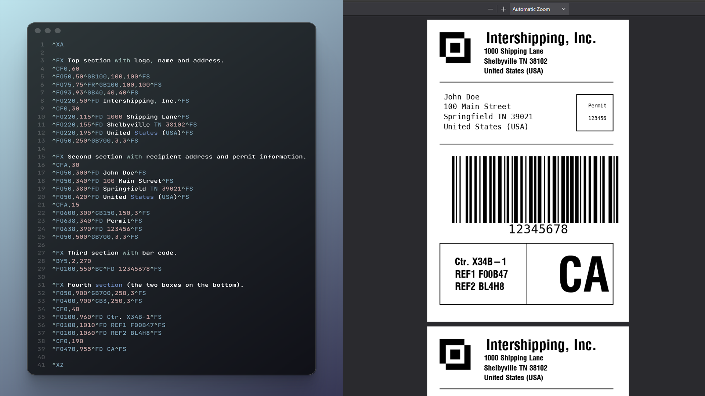

# ZPL2PDF - ZPL to PDF Converter

[](https://github.com/brunoleocam/ZPL2PDF/releases)

[](https://dotnet.microsoft.com/download)
[](https://github.com/brunoleocam/ZPL2PDF)
[](LICENSE)
[](https://hub.docker.com/r/brunoleocam/zpl2pdf)
[](https://github.com/microsoft/winget-pkgs/tree/master/manifests/b/brunoleocam/ZPL2PDF)

**[English](#)** | **[Português-BR](docs/i18n/README.pt-BR.md)** | **[Español](docs/i18n/README.es-ES.md)** | **[Français](docs/i18n/README.fr-FR.md)** | **[Deutsch](docs/i18n/README.de-DE.md)** | **[Italiano](docs/i18n/README.it-IT.md)** | **[日本語](docs/i18n/README.ja-JP.md)** | **[中文](docs/i18n/README.zh-CN.md)**

A powerful, cross-platform command-line tool that converts ZPL (Zebra Programming Language) files to high-quality PDF documents. Perfect for label printing workflows, automated document generation, and enterprise label management systems.



---

## 🚀 **What's New in v3.1.3**

### 🔧 Changed

- **Release tooling**: Scripts under `scripts/release/`; Linux packaging assets under `scripts/release/packages/` (documentation and contributor paths updated).
- **Internals**: Single Labelary PDF fallback path in `ConversionService` across CLI, API, TCP server, and daemon; dimension/value-object consolidation and daemon PID handling without reflection.

### 🛠️ Maintenance

- **Installer pipeline**: More reliable cleanup in `08-build-installer.ps1`; optional `cleanup-installer-output.ps1` for `installer/Output`.
- **Docker**: Leaner default build context via `.dockerignore`.
- **Repo hygiene**: `.github/prompts/` and `.github/skills/` remain untracked; the rest of `.github` (workflows, templates) stays versioned.

### Recent highlights (v3.1.3)

- **`--stdout`**, smarter default PDF naming, BinaryKits/PDFsharp bumps, dimension validation fix, Aztec `^B0` → `^BO` preprocessing.
- Thanks to Jacques Caruso (jacques.caruso@exhibitgroup.fr) for contributions that landed in v3.1.3.

---

## ✨ **Key Features**

### 🎯 **Three Operation Modes**

#### **Conversion Mode** - Convert individual files
```bash
ZPL2PDF -i label.txt -o output/ -n mylabel.pdf
```

#### **Daemon Mode** - Auto-monitor folders
```bash
ZPL2PDF start -l "C:\Labels"
```

#### **TCP Server Mode** - Virtual printer
```bash
ZPL2PDF server start --port 9101 -o output/
```

### 📐 **Intelligent Dimension Handling**

- ✅ Extract dimensions from ZPL commands (`^PW`, `^LL`)
- ✅ Support for multiple units (mm, cm, inches, points)
- ✅ Automatic fallback to sensible defaults
- ✅ Priority-based dimension resolution

### 🌍 **Multi-Language Interface**

Set your preferred language:
```bash
# Temporary (current session)
ZPL2PDF status --language pt-BR

# Permanent (all sessions)
ZPL2PDF --set-language pt-BR

# Check configuration
ZPL2PDF --show-language
```

**Supported Languages:**
- 🇺🇸 English (en-US)
- 🇧🇷 Português (pt-BR)
- 🇪🇸 Español (es-ES)
- 🇫🇷 Français (fr-FR)
- 🇩🇪 Deutsch (de-DE)
- 🇮🇹 Italiano (it-IT)
- 🇯🇵 日本語 (ja-JP)
- 🇨🇳 中文 (zh-CN)

---

## 📦 **Installation**

### **Windows**

#### Option 1: WinGet (Recommended)
```powershell
winget install brunoleocam.ZPL2PDF
```

#### Option 2: Installer
1. Download [ZPL2PDF-Setup.exe](https://github.com/brunoleocam/ZPL2PDF/releases/latest)
2. Run installer
3. Choose your language during installation
4. Done! ✅

### **Linux**

#### Ubuntu/Debian (.deb package)
```bash
# Download .deb package from releases
wget https://github.com/brunoleocam/ZPL2PDF/releases/download/v3.1.3/ZPL2PDF-v3.1.3-linux-amd64.deb

# Install package
sudo dpkg -i ZPL2PDF-v3.1.3-linux-amd64.deb

# Fix dependencies if needed
sudo apt-get install -f

# Verify installation
zpl2pdf -help
```

#### Fedora/CentOS/RHEL (.tar.gz)
```bash
# Download tarball from releases
wget https://github.com/brunoleocam/ZPL2PDF/releases/download/v3.1.3/ZPL2PDF-v3.1.3-linux-x64-rpm.tar.gz

# Extract to system
sudo tar -xzf ZPL2PDF-v3.1.3-linux-x64-rpm.tar.gz -C /

# Make executable
sudo chmod +x /usr/bin/ZPL2PDF

# Create symbolic link
sudo ln -s /usr/bin/ZPL2PDF /usr/bin/zpl2pdf

# Verify installation
zpl2pdf -help
```

#### Docker (All Linux distributions)
```bash
docker pull brunoleocam/zpl2pdf:latest
docker run -v ./watch:/app/watch -v ./output:/app/output brunoleocam/zpl2pdf:latest
```

### **macOS**

#### Intel Macs
```bash
# Download
curl -L https://github.com/brunoleocam/ZPL2PDF/releases/download/v3.1.3/ZPL2PDF-v3.1.3-osx-x64.tar.gz -o zpl2pdf.tar.gz

# Extract and run
tar -xzf zpl2pdf.tar.gz
./ZPL2PDF -help
```

#### Apple Silicon (M1/M2/M3)
```bash
curl -L https://github.com/brunoleocam/ZPL2PDF/releases/download/v3.1.3/ZPL2PDF-v3.1.3-osx-arm64.tar.gz -o zpl2pdf.tar.gz
tar -xzf zpl2pdf.tar.gz
./ZPL2PDF -help
```

---

## 🚀 **Quick Start**

### **Convert a Single File**
```bash
ZPL2PDF -i label.txt -o output_folder -n my_label.pdf
```

### **Convert with Custom Dimensions**
```bash
ZPL2PDF -i label.txt -o output_folder -w 10 -h 5 -u cm
```

### **Convert ZPL String Directly**
```bash
ZPL2PDF -z "^XA^FO50,50^A0N,50,50^FDHello World^FS^XZ" -o output_folder
```

### **Start Daemon Mode (Auto-Conversion)**
```bash
# Start with default settings
ZPL2PDF start

# Start with custom folder
ZPL2PDF start -l "C:\Labels" -w 7.5 -h 15 -u in

# Check status
ZPL2PDF status

# Stop daemon
ZPL2PDF stop
```

---

## 📖 **Usage Guide**

### **Conversion Mode Parameters**

```bash
ZPL2PDF -i <input_file> (-o <output_folder> | --stdout) [options]
ZPL2PDF -z <zpl_content> (-o <output_folder> | --stdout) [options]
```

| Parameter | Description | Example |
|-----------|-------------|---------|
| `-i <file>` | Input ZPL file (.txt, .prn, .zpl, .imp) | `-i label.zpl` |
| `-z <content>` | ZPL content as string | `-z "^XA...^XZ"` |
| `-o <folder>` | Output folder for PDF (required unless `--stdout`) | `-o C:\Output` |
| `--stdout` | Write PDF bytes to stdout only (no file) | `--stdout` |
| `-n <name>` | Output PDF filename (optional; default: input basename or timestamp for `-z`) | `-n result.pdf` |
| `-w <width>` | Label width | `-w 10` |
| `-h <height>` | Label height | `-h 5` |
| `-u <unit>` | Unit (mm, cm, in) | `-u cm` |
| `-d <dpi>` | Print density (default: 203) | `-d 300` |
| `--renderer` | Rendering engine (offline/labelary/auto) | `--renderer labelary` |
| `--fonts-dir` | Custom fonts directory | `--fonts-dir C:\Fonts` |
| `--font` | Map specific font | `--font "A=arial.ttf"` |

**Custom fonts (offline renderer):** ZPL font IDs (`^A0N`, `^AAN`, `^ABN`, …) are mapped to TTF/OTF files. Use `--font "A=arial.ttf"` to map font A; use multiple `--font` for B, 0, etc. If you set `--fonts-dir ./fonts`, relative paths in `--font` are resolved under that directory (e.g. `--font "A=arial.ttf"` → `./fonts/arial.ttf`). Example:

```bash
ZPL2PDF -i zpl_teste.txt -o output -n label1.pdf -d 600 -w 10.0 -h 8.0 -u cm --fonts-dir ./fonts --font "A=arial.ttf" --font "B=another.ttf"
```

### **Daemon Mode Commands**

```bash
ZPL2PDF start [options]    # Start daemon in background
ZPL2PDF stop               # Stop daemon
ZPL2PDF status             # Check daemon status
ZPL2PDF run [options]      # Run daemon in foreground (testing)
```

| Option | Description | Default |
|--------|-------------|---------|
| `-l <folder>` | Folder to monitor | `Documents/ZPL2PDF Auto Converter` |
| `-w <width>` | Fixed width for all conversions | Extract from ZPL |
| `-h <height>` | Fixed height for all conversions | Extract from ZPL |
| `-u <unit>` | Unit of measurement | `mm` |
| `-d <dpi>` | Print density | `203` |

### **TCP Server Commands**

```bash
ZPL2PDF server start [options]    # Start TCP server (virtual printer)
ZPL2PDF server stop               # Stop TCP server
ZPL2PDF server status             # Check TCP server status
```

| Option | Description | Default |
|--------|-------------|---------|
| `--port <port>` | TCP port to listen on | `9101` |
| `-o <folder>` | Output folder for PDFs | `Documents/ZPL2PDF TCP Output` |
| `--foreground` | Run in foreground (not background) | Background |
| `--renderer` | Rendering engine | `offline` |

### **Language Commands**

```bash
--language <code>           # Temporary language override
--set-language <code>       # Set language permanently
--reset-language            # Reset to system default
--show-language             # Show current configuration
```

---

## 🎨 **Rendering Engines**

### **Offline (BinaryKits)** - Default
```bash
ZPL2PDF -i label.txt -o output/ --renderer offline
```
- ✅ Works without internet
- ✅ Fast processing
- ⚠️ Some ZPL commands may render differently

### **Labelary (API)** - High Fidelity
```bash
ZPL2PDF -i label.txt -o output/ --renderer labelary
```
- ✅ Exact Zebra printer emulation
- ✅ High-fidelity rendering via Labelary (uses Labelary to generate PNGs)
- ✅ Works for multi-label ZPL inputs
- ⚠️ Requires internet connection

### **Auto (Fallback)**
```bash
ZPL2PDF -i label.txt -o output/ --renderer auto
```
- ✅ Tries Labelary first
- ✅ Falls back to BinaryKits if offline

---

## 🌐 REST API
Start the API server:

```bash
ZPL2PDF --api --host localhost --port 5000
```

### Health check

```bash
curl -s http://localhost:5000/api/health
```

```json
{
  "status": "ok",
  "service": "ZPL2PDF API"
}
```

### Convert (ZPL to PDF/PNG)

Endpoint: `POST /api/convert`

#### Request body

```json
{
  "zpl": "^XA...^XZ",
  "zplArray": ["^XA...^XZ"],
  "format": "pdf",
  "width": 7.5,
  "height": 15,
  "unit": "in",
  "dpi": 203,
  "renderer": "offline"
}
```

Notes:
- You must provide either `zpl` or `zplArray` (at least one non-empty ZPL string).
- `renderer` supports `offline` (BinaryKits), `labelary` (Labelary online API), or `auto` (try Labelary then fall back).
- If `width`/`height` are not set or are `0`, dimensions are extracted from ZPL (`^PW` / `^LL`) by default.

#### Example: PDF (offline renderer)

```bash
curl -s -X POST http://localhost:5000/api/convert -H "Content-Type: application/json" -d '{
  "zpl": "^XA^FO50,50^A0N,50,50^FDHello^FS^XZ",
  "format": "pdf",
  "renderer": "offline",
  "width": 7.5,
  "height": 3,
  "unit": "in",
  "dpi": 203
}'
```

```json
{
  "success": true,
  "format": "pdf",
  "pdf": "JVBERi0xLjQKJc...base64...",
  "pages": 1,
  "message": "Conversion successful"
}
```

#### Example: PDF (Labelary renderer - direct PDF)

```bash
curl -s -X POST http://localhost:5000/api/convert -H "Content-Type: application/json" -d '{
  "zpl": "^XA^FO50,50^A0N,50,50^FDHello^FS^XZ",
  "format": "pdf",
  "renderer": "labelary",
  "width": 7.5,
  "height": 3,
  "unit": "in",
  "dpi": 203
}'
```

```json
{
  "success": true,
  "format": "pdf",
  "pdf": "JVBERi0xLjQKJc...base64...",
  "pages": 1,
  "message": "Conversion successful"
}
```

#### Example: PNG (Labelary renderer)

```bash
curl -s -X POST http://localhost:5000/api/convert -H "Content-Type: application/json" -d '{
  "zpl": "^XA^FO50,50^A0N,50,50^FDHello^FS^XZ",
  "format": "png",
  "renderer": "labelary",
  "width": 7.5,
  "height": 3,
  "unit": "in",
  "dpi": 203
}'
```

```json
{
  "success": true,
  "format": "png",
  "image": "iVBORw0KGgo...base64...",
  "pages": 1,
  "message": "Conversion successful"
}
```

If more than one label/image is produced, the response uses `images` (array) instead of `image` (single string).

---

## 🐳 **Docker Usage**

### **Quick Start with Docker**

```bash
# Pull image
docker pull brunoleocam/zpl2pdf:latest

# Run daemon mode
docker run -d \
  --name zpl2pdf \
  -v ./watch:/app/watch \
  -v ./output:/app/output \
  -e ZPL2PDF_LANGUAGE=en-US \
  brunoleocam/zpl2pdf:latest
```

### **Docker Compose**

Create `docker-compose.yml`:

```yaml
version: '3.8'

services:
  zpl2pdf:
    image: brunoleocam/zpl2pdf:latest
    container_name: zpl2pdf-daemon
    volumes:
      - ./watch:/app/watch
      - ./output:/app/output
    environment:
      - ZPL2PDF_LANGUAGE=pt-BR
    restart: unless-stopped
```

Run:
```bash
docker-compose up -d
```

📘 **Full Docker Guide:** [docs/guides/DOCKER_GUIDE.md](docs/guides/DOCKER_GUIDE.md)

---

## 🔧 **Configuration**

### **Configuration File (`zpl2pdf.json`)**

Create a `zpl2pdf.json` file in the application directory:

```json
{
  "language": "en-US",
  "defaultListenFolder": "C:\\Users\\user\\Documents\\ZPL2PDF Auto Converter",
  "labelWidth": 10,
  "labelHeight": 5,
  "unit": "cm",
  "dpi": 203,
  "logLevel": "Info",
  "retryDelay": 2000,
  "maxRetries": 3
}
```

See [zpl2pdf.json.example](zpl2pdf.json.example) for full configuration options.

### **Environment Variables**

| Variable | Description | Example |
|----------|-------------|---------|
| `ZPL2PDF_LANGUAGE` | Application language | `pt-BR` |

📘 **Language Configuration Guide:** [docs/guides/LANGUAGE_CONFIGURATION.md](docs/guides/LANGUAGE_CONFIGURATION.md)

---

## 📐 **ZPL Support**

### **Supported ZPL Commands**

- ✅ `^XA` / `^XZ` - Label start/end
- ✅ `^PW<width>` - Print width in points
- ✅ `^LL<length>` - Label length in points
- ✅ All standard ZPL text, graphics, and barcode commands

### **Dimension Extraction**

ZPL2PDF automatically extracts dimensions:

```zpl
^XA
^PW800        ← Width: 800 points
^LL1200       ← Height: 1200 points
^FO50,50^A0N,50,50^FDHello^FS
^XZ
```

**Conversion:** `mm = (points / 203) * 25.4`

### **Priority Logic**

1. ⭐ **Explicit Parameters** (`-w`, `-h`) - Highest priority
2. ⭐⭐ **ZPL Commands** (`^PW`, `^LL`) - If no parameters
3. ⭐⭐⭐ **Default Values** (100mm × 150mm) - Fallback

---

## 🏗️ **Architecture**

ZPL2PDF follows **Clean Architecture** principles:

```
src/
├── Application/          # Use Cases & Services
│   ├── Services/         # Business logic
│   └── Interfaces/       # Service contracts
├── Domain/              # Business entities & rules
│   ├── ValueObjects/    # Value objects
│   └── Services/        # Domain interfaces
├── Infrastructure/      # External concerns
│   ├── FileSystem/      # File operations
│   ├── Rendering/       # PDF generation
│   └── Processing/      # Queue management
├── Presentation/        # CLI & user interface
│   └── Handlers/        # Mode handlers
└── Shared/             # Common utilities
    ├── Localization/   # Multi-language
    └── Constants/      # Configuration
```

---

## 🧪 **Testing**

### **Run Tests**

```bash
# All tests
dotnet test

# Unit tests only
dotnet test tests/ZPL2PDF.Unit/

# Integration tests
dotnet test tests/ZPL2PDF.Integration/

# With coverage
dotnet test --collect:"XPlat Code Coverage"
```

### **Test Coverage**
- ✅ Unit Tests: 90%+ coverage
- ✅ Integration Tests: End-to-end workflows
- ✅ Cross-Platform: Windows, Linux, macOS

---

## 📚 **Documentation**

### **User Guides**
- 📖 [Complete Documentation](docs/README.md) - Full user manual
- 🌍 [Multi-language Configuration](docs/guides/LANGUAGE_CONFIGURATION.md)
- 🐳 [Docker Usage Guide](docs/guides/DOCKER_GUIDE.md)
- 📦 [Inno Setup Guide](docs/INNO_SETUP_GUIDE.md)

### **Developer Guides**
- 🛠️ [Contributing Guide](CONTRIBUTING.md)
- 📋 [Changelog](CHANGELOG.md)
- 🏗️ [Architecture Overview](wiki/Architecture-Overview.md)
- 🔄 [CI/CD Workflow](docs/development/CI_CD_WORKFLOW.md)

### **Build & Deployment**
- 🔨 [Build Scripts](scripts/README.md)
- 🐳 [Docker Publishing](docs/DOCKER_PUBLISH_GUIDE.md)
- 📦 [Windows Installer](installer/README.md)

---

## 💡 **Use Cases**

### **1. ERP Integration**
```csharp
// C# example
Process.Start("ZPL2PDF.exe", "-i label.txt -o output/ -w 10 -h 5 -u cm");
```

### **2. Batch Processing**
```bash
# Process all ZPL files in a folder
for file in *.txt; do
    ZPL2PDF -i "$file" -o output/
done
```

### **3. Automated Workflow**
```bash
# Start daemon on system startup
ZPL2PDF start -l "C:\Labels\Incoming"
```

### **4. Docker Deployment**
```bash
# Deploy to server
docker run -d \
  -v /srv/labels:/app/watch \
  -v /srv/pdfs:/app/output \
  --restart always \
  brunoleocam/zpl2pdf:latest
```

---

## 📊 **Performance**

### **Benchmarks**

| Metric | Value |
|--------|-------|
| **Single Label** | ~50ms |
| **Batch Processing** | 100+ labels/minute |
| **Memory Usage** | <50MB typical |
| **PDF File Size** | ~100KB per label |
| **Startup Time** | <1 second |

### **Optimization Features**
- ✅ Async processing with configurable concurrency
- ✅ Retry mechanisms for locked files
- ✅ Memory-efficient image processing
- ✅ Optimized PDF generation with compression

---

## 🛠️ **Development**

### **Prerequisites**

- .NET 9.0 SDK or later
- Git
- Visual Studio 2022 or VS Code
- Docker (for cross-platform testing)

### **Build from Source**

```bash
# Clone repository
git clone https://github.com/brunoleocam/ZPL2PDF.git
cd ZPL2PDF

# Restore dependencies
dotnet restore

# Build solution
dotnet build

# Run tests
dotnet test

# Build for your platform
dotnet publish -c Release -r win-x64 --self-contained true

# Build all platforms
.\scripts\build-all-platforms.ps1  # Windows
./scripts/build-all-platforms.sh   # Linux/macOS
```

### **Project Structure**

```
ZPL2PDF/
├── src/                    # Source code (Clean Architecture)
├── tests/                  # Unit & integration tests
├── docs/                   # Documentation
│   ├── i18n/              # Translated documentation
│   ├── Image/             # Screenshots & icons
│   └── Sample/            # Sample ZPL files
├── installer/              # Windows installer (Inno Setup)
├── scripts/                # Build & release scripts
├── .github/workflows/      # GitHub Actions CI/CD
├── docker-compose.yml      # Docker orchestration
└── Dockerfile              # Docker image definition
```

---

## 🐛 **Troubleshooting**

### **Common Issues**

| Issue | Solution |
|-------|----------|
| **File Locked Error** | Wait for the process writing the file to complete |
| **Invalid ZPL Content** | Ensure file contains valid ZPL commands (`^XA...^XZ`) |
| **Permission Denied** | Run with appropriate permissions or check folder access |
| **Docker: libgdiplus not found** | Use official image: `brunoleocam/zpl2pdf:alpine` |

### **Debug Mode**

```bash
# Enable verbose logging by setting "logLevel": "Debug" in `zpl2pdf.json`
# (then re-run your command)
ZPL2PDF -i label.txt -o output/
```

### **Get Help**

- 📖 [Wiki](https://github.com/brunoleocam/ZPL2PDF/wiki)
- 🐛 [Issues](https://github.com/brunoleocam/ZPL2PDF/issues)
- 💬 [Discussions](https://github.com/brunoleocam/ZPL2PDF/discussions)

---

## 🤝 **Contributing**

We welcome contributions! See [CONTRIBUTING.md](CONTRIBUTING.md) for details.

### **Quick Start**

```bash
# 1. Fork and clone
git clone https://github.com/YOUR_USERNAME/ZPL2PDF.git

# 2. Create feature branch
git checkout -b feature/amazing-feature

# 3. Make changes and test
dotnet test

# 4. Commit and push
git commit -m "feat: add amazing feature"
git push origin feature/amazing-feature

# 5. Create Pull Request
```

---

## 📄 **License**

This project is licensed under the MIT License - see the [LICENSE](LICENSE) file for details.

---

## 🙏 **Acknowledgments**

Built with amazing open-source libraries:

- [BinaryKits.Zpl](https://github.com/BinaryKits/BinaryKits.Zpl) - ZPL parsing and rendering
- [PdfSharpCore](https://github.com/empira/PdfSharpCore) - PDF generation
- [SkiaSharp](https://github.com/mono/SkiaSharp) - Cross-platform graphics

---

## 📞 **Support**

- 📖 **Documentation**: [Full documentation](docs/)
- 🐛 **Bug Reports**: [GitHub Issues](https://github.com/brunoleocam/ZPL2PDF/issues)
- 💬 **Questions**: [GitHub Discussions](https://github.com/brunoleocam/ZPL2PDF/discussions)
- 📧 **Email**: [Contact](mailto:brunoleocam@gmail.com)

---

## 💝 **Support the Project**

If ZPL2PDF helps you, consider supporting its development:

- ☕ [Buy Me a Coffee](https://buymeacoffee.com/brunoleocam)
- 🎗️ [Patreon](https://patreon.com/brunoleocam)
- 💖 [GitHub Sponsors](https://github.com/sponsors/brunoleocam)

Your support helps maintain and improve ZPL2PDF for everyone!

---

## 🌟 **Star History**

If ZPL2PDF helps you, please ⭐ star the repository!

---

## 👥 **Contributors**

Thanks to all contributors who have helped make ZPL2PDF better!

Special thanks to Jacques Caruso (jacques.caruso@exhibitgroup.fr) for sending the solutions for version 3.1.3.

<a href="https://github.com/brunoleocam/ZPL2PDF/graphs/contributors">
  
</a>

_Image may be cached; [see full list on GitHub](https://github.com/brunoleocam/ZPL2PDF/graphs/contributors)._

---

**ZPL2PDF** - Convert ZPL labels to PDF easily and efficiently.