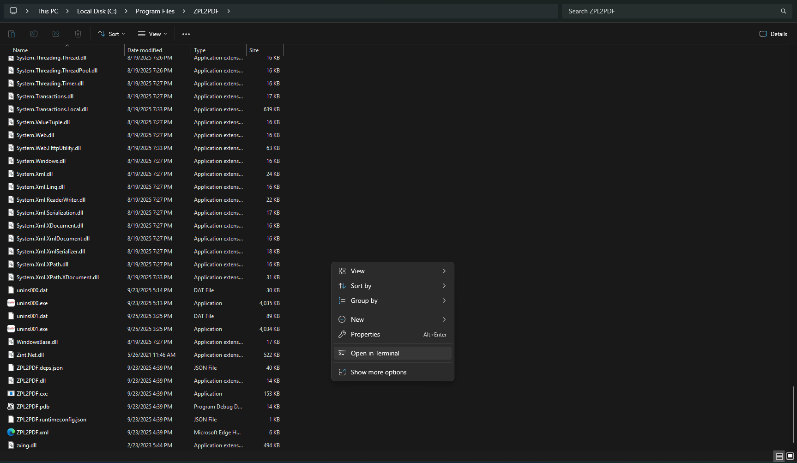
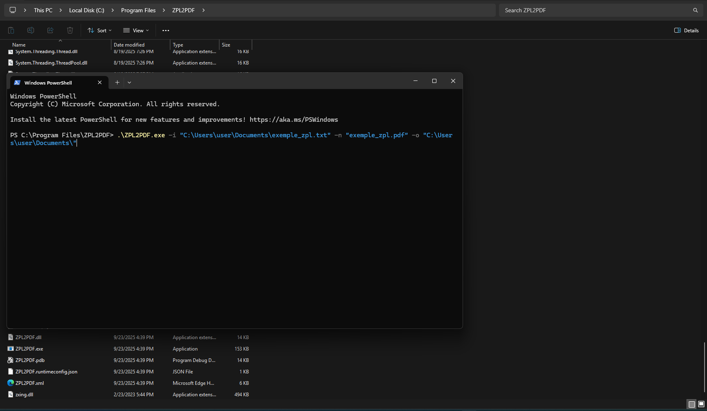

# Documentation - ZPL2PDF

## Introduction

This project is built on top of the [BinaryKits.Zpl](https://github.com/BinaryKits/BinaryKits.Zpl) library.

ZPL2PDF is a project for converting labels in ZPL format into a PDF file. The program processes the labels, renders images in memory and compiles these images into a PDF, where each page contains a label.

## Installation

1. Download the installer [`Setup.exe`](https://github.com/brunoleocam/ZPL2PDF/releases) from the **Releases** section.
2. Run the installer.
3. The program will be installed in:

```sh
C:\Program Files\ZPL2PDF
```



## How to Use

1. Open **Command Prompt (cmd)** or **PowerShell**.  
2. Navigate to the installation folder:

```sh
cd "C:\Program Files\ZPL2PDF"
```

3. Run the converter with the parameters:

```sh
.\ZPL2PDF.exe -i "C:\Users\user\Documents\exemple_zpl.txt" -n "exemple_zpl.pdf" -o "C:\Users\user\Documents\"
```

-  **-i** → Path to the input ZPL file
-  **-n** → Name of the output PDF file
-  **-o** → Output directory where the PDF will be saved



In the example above, the file **exemple_zpl.pdf** will be generated inside the user’s **Documents** folder.

## Features

- **Label Processing:** 
   Uses the `LabelFileReader` class to read the file and separate the labels based on the `^XA` and `^XZ` delimiters.

- **In-Memory Rendering:** 
   The `LabelRenderer` class analyzes the ZPL content and renders the labels into images, keeping the data in memory without the need for temporary storage.

- **PDF Generation:** 
   The `PdfGenerator` class generates a PDF where each image is added to a page. The PDF file is saved in the user's specified output folder, using the specified output file name or a default name based on the current date and time.

## Execution Flow

1. **Receiving Parameters:**  
   The `Main` method analyzes the arguments received:
   - The `-i` parameter specifies the input file path.
   - The `-z` parameter specifies the ZPL content directly.
   - The `-o` parameter specifies the output folder path.
   - The `-n` parameter specifies the output file name (optional).
   - The `-w` and `-h` parameters specify the width and height of the label, respectively.
   - The `-d` parameter specifies the print density in dots per millimeter.
   - The `-u` parameter specifies the unit of measurement for width and height ("in", "cm", "mm").
   - The `-help` parameter displays the help message.

2. **Content reading**  
   The file is read using `LabelFileReader.ReadFile(inputFile)` or the ZPL content is used directly.

3. **Label separation:**  
   The `LabelFileReader.SplitLabels(fileContent)` method splits the content into individual labels, based on the `^XA` and `^XZ` delimiters.

4. **Image rendering**  
   The `LabelRenderer` class processes each label and renders images (in byte[]) with the defined dimensions and density.

5. **PDF generation:**  
   The PDF is generated using the `PdfGenerator.GeneratePdf(imageDataList, outputPdf)` class, where `outputPdf` is built in the specified output folder with the specified output file name or a default name.

## Usage Examples

1. **Specifying the Input and Output:** 

   - Reads the specified file and saves it in the specified output folder.

      ```sh
      ZPL2PDF.exe -i "C:\Path\to\input.txt" -o "C:\Path\to\output"
      ```

2. **Specifying the ZPL Content Directly:**

   - Uses the specified ZPL content and saves it in the specified output folder.

      ```sh
      ZPL2PDF.exe -z "^XA^FO50,50^ADN,36,20^FDHello, World!^FS^XZ" -o "C:\Path\to\output"
      ```

3. **Specifying the Output File Name:**

   - Reads the specified file, saves it in the specified output folder with the specified output file name.

      ```sh
      ZPL2PDF.exe -i "C:\Path\to\input.txt" -o "C:\Path\to\output" -n "output_filename.pdf"
      ```

4. **Specifying Width, Height, and Print Density:**

   - Reads the specified file, sets the width, height, and print density, and saves it in the specified output folder.

      ```sh
      ZPL2PDF.exe -i "C:\Path\to\input.txt" -o "C:\Path\to\output" -w 6 -h 12 -u "cm" -d 8
      ```

5. **Displaying the Help Message:**

   - Displays the help message with the description of the parameters.

      ```sh
      ZPL2PDF.exe -help
      ```

## Integration with Other Systems

The program can be compiled into an executable (ZPL2PDF.exe) and called from another application, such as an ERP, using functions to start processes (e.g., Process.Start in C#) and passing the necessary parameters.

## Dependencies
   
   - **BinaryKits.Zpl:** For analyzing and rendering ZPL labels.
   - **PdfSharpCore:** For creating and manipulating the PDF file.

## Conclusion

ZPL2PDF was developed with a focus on modularization (separate classes for reading, rendering, and generating the PDF) and flexibility, allowing different input options and easy integration with other systems.

## Other Languages

- [Português](README.pt.md)
