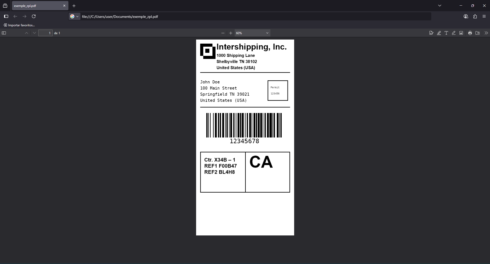

[](https://github.com/brunoleocam/ZPL2PDF/blob/main/README.md)

# Conversor ZPL para PDF (ZPL2PDF) – Converter etiquetas ZPL em PDF

## Introdução

ZPL2PDF é um conversor rápido e offline de ZPL para PDF. Ele lê etiquetas no Zebra Programming Language (ZPL/ZPL II), renderiza-as na memória e exporta um PDF multi‑página onde cada página é uma etiqueta. Construído sobre a confiável stack [BinaryKits.Zpl](https://github.com/BinaryKits/BinaryKits.Zpl), é ideal para integrações com ERP/warehouse, processamento em lote e pipelines automatizados de impressão.

Palavras‑chave: ZPL para PDF, Etiqueta para PDF, conversor de etiquetas Zebra, renderizador ZPL, CLI para Windows, conversão offline, integração com ERP.

## Sumário

- [Instalação](#instalação)
- [Início rápido](#início-rápido)
- [Como usar](#como-usar)
- [Funcionalidades](#funcionalidades)
- [Fluxo de Execução](#fluxo-de-execução)
- [Exemplos de Uso](#exemplos-de-uso)
- [Opções da CLI](#opções-da-cli)
- [Integração com Outros Sistemas](#integração-com-outros-sistemas)
- [Dependências](#dependências)
- [Outros Idiomas](#outros-idiomas)

## Compilando após clonar

> [!CAUTION]
> Se você clonar ou fizer fork do projeto, execute os comandos abaixo para gerar os arquivos necessários:
> 
> ```sh
> dotnet build
> dotnet publish -c Release
> ```

Isso irá recriar todos os arquivos de saída e dependências automaticamente.

## Instalação

1. Baixe o instalador [`Setup.exe`](https://github.com/brunoleocam/ZPL2PDF/releases) na seção **Releases** do projeto.
2. Execute o instalador.
3. O programa será instalado em:

```sh
C:\Program Files\ZPL2PDF
```


## Início rápido

Converta um arquivo ZPL para PDF com um comando:

```powershell
& "C:\Program Files\ZPL2PDF\ZPL2PDF.exe" -i "C:\Users\user\Documents\exemple_zpl.txt" -o "C:\Users\user\Documents" -n "exemple_zpl.pdf"
```

## Como usar

1. Abra o **Prompt de Comando (cmd)** ou **PowerShell**.   
2. Navegue até a pasta de instalação:

```sh
cd "C:\Program Files\ZPL2PDF"
```

3. Execute o conversor passando os parâmetros:

```sh
.\ZPL2PDF.exe -i "C:\Users\user\Documents\exemple_zpl.txt" -n "exemple_zpl.pdf" -o "C:\Users\user\Documents\"
```

-  **-i** → Caminho do arquivo ZPL de entrada
-  **-n** → Nome do PDF de saída
-  **-o** → Pasta de destino para salvar o PDF


No exemplo acima, o arquivo **exemple_zpl.pdf** será criado dentro da pasta **Documentos** do usuário.



## Funcionalidades

- **Renderização precisa de ZPL (ZPL/ZPL II):**
   Renderiza etiquetas ZPL em imagens de alta qualidade totalmente na memória, sem arquivos temporários.

- **Conversão em lote para PDF:**
   Várias etiquetas tornam‑se um PDF multi‑página (uma etiqueta por página).

- **CLI amigável no Windows:**
   Interface de linha de comando simples, ideal para scripts, ERPs e serviços.

- **Tamanho de página e densidade configuráveis:**
   Controle largura, altura, unidades e densidade para combinar com as impressoras.

## Fluxo de Execução

1. **Recebendo Parâmetros:**  
   O método `Main` analisa os argumentos recebidos:
   - O parâmetro `-i` especifica o caminho do arquivo de entrada.
   - O parâmetro `-z` especifica o conteúdo ZPL diretamente.
   - O parâmetro `-o` especifica o caminho da pasta de saída.
   - O parâmetro `-n` especifica o nome do arquivo de saída (opcional).
   - Os parâmetros `-w` e `-h` especificam a largura e altura da etiqueta, respectivamente.
   - O parâmetro `-d` especifica a densidade de impressão em pontos por milímetro.
   - O parâmetro `-u` especifica a unidade de medida para largura e altura ("in", "cm", "mm").
   - O parâmetro `-help` exibe a mensagem de ajuda.

2. **Leitura do Conteúdo**  
   O arquivo é lido usando `LabelFileReader.ReadFile(inputFile)` ou o conteúdo ZPL é usado diretamente.

3. **Separação de Etiquetas:**  
   O método `LabelFileReader.SplitLabels(fileContent)` divide o conteúdo em etiquetas individuais, com base nos delimitadores `^XA` e `^XZ`.

4. **Renderização de Imagens**  
   A classe `LabelRenderer` processa cada etiqueta e renderiza imagens (em byte[]) com as dimensões e densidade definidas.

5. **Geração de PDF:**  
   O PDF é gerado usando a classe `PdfGenerator.GeneratePdf(imageDataList, outputPdf)`, onde `outputPdf` é construído na pasta de saída especificada com o nome de arquivo de saída especificado ou um nome padrão.

## Exemplos de Uso

1. **Especificando o Caminho de Entrada e Saída:** 

   - Lê o arquivo especificado e salva na pasta de saída especificada.

      ```sh
      ZPL2PDF.exe -i "C:\Caminho\para\input.txt" -o "C:\Caminho\para\output"
      ```

2. **Especificando o Conteúdo ZPL Diretamente:**

   - Usa o conteúdo ZPL especificado e salva na pasta de saída especificada.

      ```sh
      ZPL2PDF.exe -z "^XA^FO50,50^ADN,36,20^FDHello, World!^FS^XZ" -o "C:\Caminho\para\output"
      ```

3. **Especificando o Nome do Arquivo de Saída:**

   - Lê o arquivo especificado, salva na pasta de saída especificada com o nome de arquivo de saída especificado.

      ```sh
      ZPL2PDF.exe -i "C:\Caminho\para\input.txt" -o "C:\Caminho\para\output" -n "nome_arquivo_saida.pdf"
      ```

4. **Especificando Largura, Altura e Densidade de Impressão:**

   - Lê o arquivo especificado, define a largura, altura e densidade de impressão, e salva na pasta de saída especificada.

      ```sh
      ZPL2PDF.exe -i "C:\Caminho\para\input.txt" -o "C:\Caminho\para\output" -w 6 -h 12 -u "cm" -d 8
      ```

5. **Exibindo a Mensagem de Ajuda:**

   - Exibe a mensagem de ajuda com a descrição dos parâmetros.

      ```sh
      ZPL2PDF.exe -help
      ```

## Integração com Outros Sistemas

O programa pode ser compilado em um executável (ZPL2PDF.exe) e chamado a partir de outra aplicação, como um ERP, usando funções para iniciar processos (por exemplo, Process.Start em C#) e passando os parâmetros necessários.

## Opções da CLI

| Opção | Descrição | Exemplo |
|---|---|---|
| `-i` | Arquivo de entrada com conteúdo ZPL | `-i "C:\Caminho\para\input.txt"` |
| `-z` | Conteúdo ZPL bruto passado diretamente | `-z "^XA^FO50,50...^XZ"` |
| `-o` | Pasta de saída para o PDF gerado | `-o "C:\Caminho\para\output"` |
| `-n` | Nome do arquivo PDF de saída | `-n "etiquetas.pdf"` |
| `-w` | Largura da etiqueta (com `-u`) | `-w 4` |
| `-h` | Altura da etiqueta (com `-u`) | `-h 6` |
| `-u` | Unidade para largura/altura: `in`, `cm`, `mm` | `-u "cm"` |
| `-d` | Densidade de impressão em pontos por milímetro | `-d 8` |
| `-help` | Exibe ajuda | `-help` |

## Dependências
   
   - **BinaryKits.Zpl:** Para analisar e renderizar etiquetas ZPL.
   - **PdfSharpCore:** Para criar e manipular o arquivo PDF.

## Conclusão

ZPL2PDF foi desenvolvido com foco na modularização (classes separadas para leitura, renderização e geração do PDF) e flexibilidade, permitindo diferentes opções de entrada e fácil integração com outros sistemas.

## Outros Idiomas

- [English](README.md)